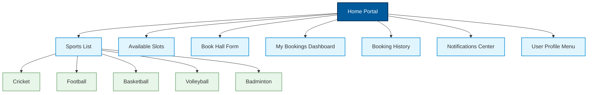
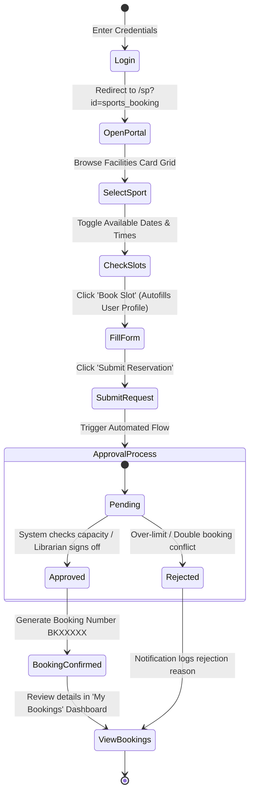

# Sports Hall Booking System in ServiceNow
## Phase 3: UI/UX Development & Customization
## Section 9: Navigation Flow Documentation

## 1. Objective
The objective of this task is to provide a seamless navigation experience throughout the Sports Hall Booking Portal. Designing a clear navigation map ensures users can check availability, complete bookings, and review histories with minimal clicks and zero confusion.

## 2. Navigation Structure
The portal layout is structured hierarchically. The Home page serves as the root index, branching into specific functional widgets and detail views:


*Figure 1: Portal Navigation Hierarchy Map.*

---

## 3. User Navigation Flow
The step-by-step process of reserving a slot transitions through the following actions:


*Figure 2: User traversal flow from entry to booking verification.*

---

## 4. Portal Navigation Features
To support fluid page transitions, the Service Portal header and page layout include the following controls:
* **Fixed Navigation Bar**: Glues the main header containing branding links, search, profile, and logout buttons to the top of the browser screen during scrolling.
* **Global Search Box**: Autocomplete input field indexing halls, reservation guides, and personal booking logs.
* **Breadcrumb Navigation**: Shows path indicator dynamically (e.g. `Home > Sports List > Badminton Court > Booking Form`), allowing one-click step back.
* **Quick Access Action Buttons**: Floating widgets or home screen tiles for "Book Now" or "My Active Bookings".
* **Profile Dropdown Menu**: Accessible in top navbar for adjusting user parameters or viewing preferences.

#### UI Mockup 1: Breadcrumb and Fixed Header Element Mockup
```
================================================================================
| [Sport Logo]  Sports Hall Portal  [Search slots...]    John Doe (Profile) |▼| |
================================================================================
| Home > Sports List > Badminton Court > Slot Selection > Booking Form          |
================================================================================
```
*Figure 3: Breadcrumb Navigation UI mockup.*

---

## 5. Responsive Design Support
The navigation bar, sidebar menus, and card grids are built using Bootstrap responsive classes, ensuring compatibility across all screen configurations:

| Device Viewport | Width Range | Interface Adaptation |
| :--- | :--- | :--- |
| **Desktop / Monitor** | `> 1200px` | Full multi-column dashboard grid layout; sidebars expanded. |
| **Laptop** | `992px - 1200px`| Two-column display; sidebars collapsed into drawer slides. |
| **Tablet** | `768px - 991px` | Sports selector cards wrap into two columns; header navigation links collapse. |
| **Mobile Phone** | `< 767px` | Single column stacked view; navbar links collapsed behind a hamburger icon. |

---

## 6. User Experience Features
* **Simple Booking Process**: Reduced to 3 clicks: Select Sport ──> Pick Slot ──> Submit.
* **Fast Page Loading**: Lightweight custom widgets minimize REST call payloads.
* **Interactive Form Validation**: Client-side validation prevents submitting past dates or over-limit player sizes before hitting the database.
* **Clear Status Badges**: Uses distinct colors (`Pending` in blue, `Confirmed` in green, `Rejected` in red) to track reservation progress.

---

## 7. Deliverables
1. **Responsive Service Portal**: The core portal shell (`/sports_booking`) styled with corporate CSS variables.
2. **Custom Booking Widgets**: Client-controlled widgets dynamically loading slot availability details.
3. **Integrated Booking Workflow**: Automatically triggers ServiceNow flow processes upon request submission.
4. **Bootstrap Layout Panels**: Flexible templates supporting multi-device responsive scaling.
